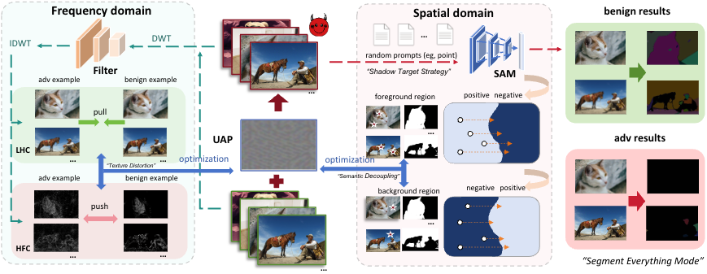

# DarkSAM
The implementation of our NeurIPS 2024 paper "DarkSAM: Fooling Segment Anything Model to Segment Nothing".


## Abstract
Segment Anything Model (SAM) has recently gained much attention for its outstanding generalization to unseen data and tasks. Despite its promising prospect, the vulnerabilities of SAM, especially to universal adversarial perturbation (UAP) have not been thoroughly investigated yet. In this paper, we propose DarkSAM, the first prompt-free universal attack framework against SAM, including a semantic decoupling-based spatial attack and a texture distortion-based frequency attack. We first divide the output of SAM into foreground and background. Then, we design a shadow target strategy to obtain the semantic blueprint of the image as the attack target. DarkSAM is dedicated to fooling SAM by extracting and destroying crucial object features from images in both spatial and frequency domains. In the spatial domain, we disrupt the semantics of both the foreground and background in the image to confuse SAM. In the frequency domain, we further enhance the attack effectiveness by distorting the high-frequency components (i.e., texture information) of the image. Consequently, with a single UAP, DarkSAM renders SAM incapable of segmenting objects across diverse images with varying prompts. Experimental results on four datasets for SAM and its two variant models demonstrate the powerful attack capability and transferability of DarkSAM.



## Latest Update
**2024/11/4**   We have released the official implementation code.
## Setup
- **Get code**
```shell 
git clone https://github.com/CGCL-codes/DarkSAM.git
```
- **Build environment**
```shell
cd DarkSAM
# use anaconda to build environment 
conda create -n DarkSAM python=3.8
conda activate DarkSAM
# install packages
pip install -r requirements.txt
```
- **The final project should be like this:**
    ```shell
    DarkSAM
    └- image
        └- pipeline
    └- repo
        └- segment-anything
          └- ...
          └- ckpt
            └- sam_vit_b_01ec64.pth
        └- init_repos.sh
    └- data
      └- SAM_data
    └- ...
    ```
- **Download Victim Pre-trained Encoders**
  - Our pre-trained encoders were obtained from the [SAM](https://github.com/facebookresearch/segment-anything) repository.
  - Please move the downloaded pre-trained encoder into  /repo/segment-anything/ckpt.

## Quick Start

- **See [here](https://ai.meta.com/datasets/segment-anything/) for an overview of the datastet. The dataset can be downloaded [here](https://ai.meta.com/datasets/segment-anything-downloads/).**
- **run `init_repos.sh` to init repos and download basic SAM checkpoints**
```shell
cd repo
bash init_repos.sh
cd ..
```
- **Train UAP**
```shell 
python darksam_attack.py   # results saved in uap_file/SA1B.pth
```
- **Test performance of DarkSAM**
```shell 
python darksam_test.py # results saved in /result/test
```

## BibTeX 
If you find DarkSAM both interesting and helpful, please consider citing us in your research or publications:
```bibtex
@inproceedings{zhou2024darksam,
  title={Darksam: Fooling segment anything model to segment nothing},
  author={Zhou, Ziqi and Song, Yufei and Li, Minghui and Hu, Shengshan and Wang, Xianlong and Zhang, Leo Yu and Yao, Dezhong and Jin, Hai},
  booktitle={Proceedings of the 38th Annual Conference on Neural Information Processing Systems (NeurIPS'24)},
  year={2024}
}
```
